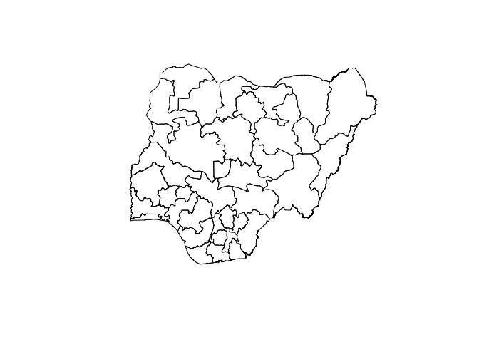
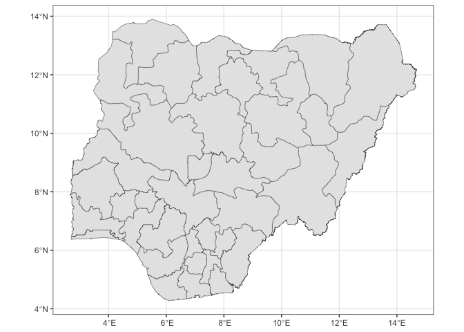
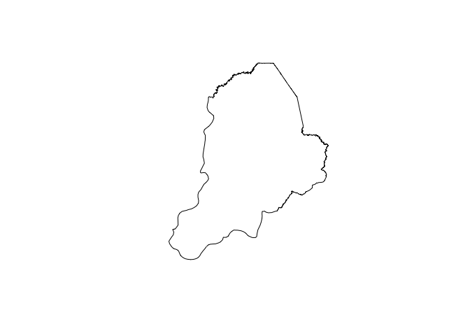
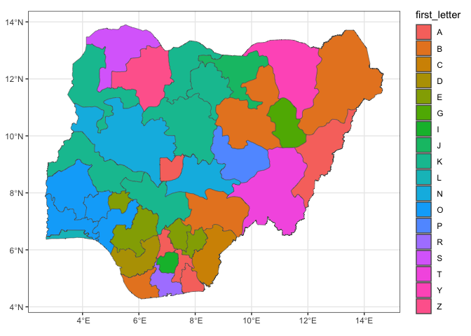
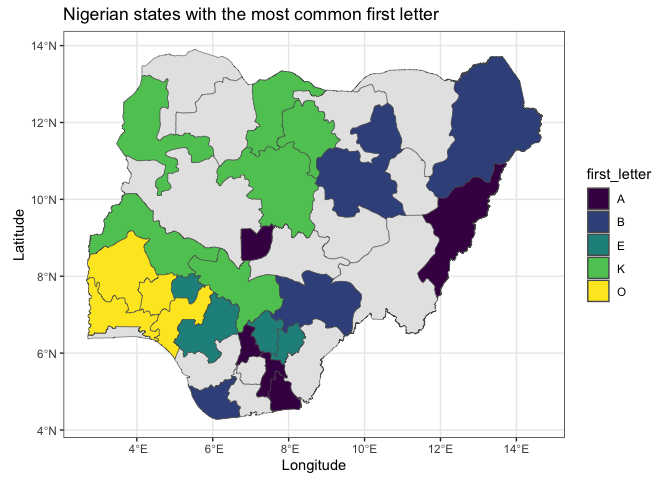
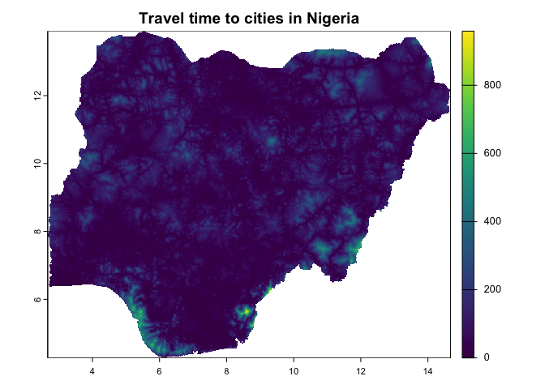
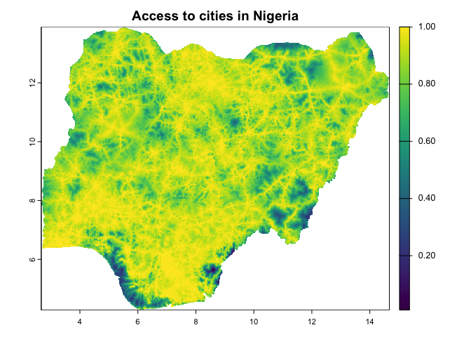
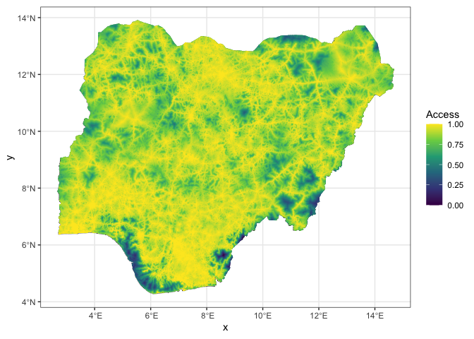
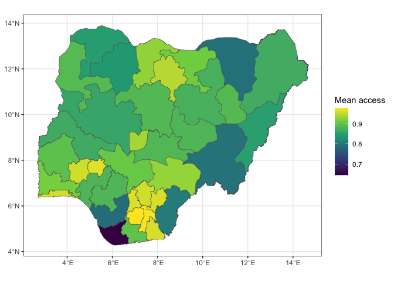

<!---Note this will remove itself:-->

<!---
permalink: /teaching/chloropleths_101
title: Chloropleths + the malariaAtlas accessibility raster in one go!
toc: true
--->

## Preamble

Here’s a quick workshop to introduce some basic mapping techniques in R.
We’ll also have a look at some of the raster products released by the
Malaria Atlas Project.

I’ll show a mix of base graphics and `ggplot2`: while ggplot is often
the way to go, it doesn’t hurt to understand some base graphics!

## Packages

Here are some bread and butter packages:

``` r
library(tidyverse)
theme_set(theme_bw()) # save myself some time later ...
library(sf)
library(terra) # for rasters
library(malariaAtlas)
```

## Polygons

Lots of spatial analysis relies on data associated with specific
administrative units. For the purposes of this demonstration, let’s
retrieve admin level 1s in Nigeria.

There’s lots of packages we can grab these data from,
e.g. `rnaturalearth` and `worlddatr`. Here’s how you can do it with the
MAP package:

``` r
nigeria <- malariaAtlas::getShp(country = "Nigeria", 
                                admin_level = "admin1")
```

    ## Start tag expected, '<' not found
    ## Start tag expected, '<' not found

``` r
# in base graphics:
# the st_geometry() picks out the geometry from the simple feature collection
plot(st_geometry(nigeria))
```

<!-- -->

``` r
# in ggplot
ggplot() +
  geom_sf(data = nigeria)
```

<!-- -->

Have a look at `nigeria`: it’s a simple feature collection that looks a
bit like a data.frame. However, each row as geometry associated with it,
as well as regular columns!

``` r
head(nigeria)
```

    ## Simple feature collection with 6 features and 16 fields
    ## Geometry type: MULTIPOLYGON
    ## Dimension:     XY
    ## Bounding box:  xmin: 3.4711 ymin: 7.4341 xmax: 14.6781 ymax: 13.7146
    ## Geodetic CRS:  WGS 84
    ##   iso admn_level  name_0     id_0  type_0  name_1     id_1 type_1 name_2 id_2
    ## 1 NGA          1 Nigeria 10000939 Country   Borno 10316414  State     NA   NA
    ## 2 NGA          1 Nigeria 10000939 Country    Yobe 10314496  State     NA   NA
    ## 3 NGA          1 Nigeria 10000939 Country Katsina 10314910  State     NA   NA
    ## 4 NGA          1 Nigeria 10000939 Country   Kebbi 10314662  State     NA   NA
    ## 5 NGA          1 Nigeria 10000939 Country   Gombe 10313923  State     NA   NA
    ## 6 NGA          1 Nigeria 10000939 Country Adamawa 10315851  State     NA   NA
    ##   type_2 name_3 id_3 type_3    source                       geometry
    ## 1     NA     NA   NA     NA GAUL 2015 MULTIPOLYGON (((13.332 13.7...
    ## 2     NA     NA   NA     NA GAUL 2015 MULTIPOLYGON (((11.1776 13....
    ## 3     NA     NA   NA     NA GAUL 2015 MULTIPOLYGON (((7.8783 13.3...
    ## 4     NA     NA   NA     NA GAUL 2015 MULTIPOLYGON (((4.3615 13.2...
    ## 5     NA     NA   NA     NA GAUL 2015 MULTIPOLYGON (((11.2449 11....
    ## 6     NA     NA   NA     NA GAUL 2015 MULTIPOLYGON (((13.7318 10....
    ##   country_level
    ## 1         NGA_1
    ## 2         NGA_1
    ## 3         NGA_1
    ## 4         NGA_1
    ## 5         NGA_1
    ## 6         NGA_1

``` r
# this gives us a data.frame without any geometry
nigeria %>%
  st_geometry() %>%
  head()
```

    ## Geometry set for 6 features 
    ## Geometry type: MULTIPOLYGON
    ## Dimension:     XY
    ## Bounding box:  xmin: 3.4711 ymin: 7.4341 xmax: 14.6781 ymax: 13.7146
    ## Geodetic CRS:  WGS 84
    ## First 5 geometries:

    ## MULTIPOLYGON (((13.332 13.7146, 13.3381 13.7144...

    ## MULTIPOLYGON (((11.1776 13.3754, 11.181 13.3747...

    ## MULTIPOLYGON (((7.8783 13.3311, 7.8818 13.3297,...

    ## MULTIPOLYGON (((4.3615 13.2092, 4.3798 13.1896,...

    ## MULTIPOLYGON (((11.2449 11.2936, 11.2878 11.266...

``` r
# we can pick out rows just like a data frame!
plot(st_geometry(nigeria[1,]))
```

<!-- -->

## Our first chloropleth

Let’s have a first go at a chloropleth map … for demonstration, let’s
map the first letter of the state name:

``` r
nigeria <- mutate(nigeria,
                  first_letter = substr(name_1, 1, 1) %>% factor())

ggplot() +
  geom_sf(data = nigeria,
          aes(fill = first_letter))
```

<!-- -->

That’s way too many colours! How about we just look at the five most
common letters? And go for some groovy colours?

``` r
most_common_letters <- nigeria %>%
  st_drop_geometry() %>%
  group_by(first_letter) %>%
  summarise(n = n()) %>%
  arrange(n) %>%
  tail(n = 5) %>%
  dplyr::select(first_letter) %>%
  unlist()

ggplot() +
  geom_sf(data = nigeria) + # give us all of the states first
  geom_sf(data = nigeria %>% 
            filter(first_letter %in% most_common_letters),
          aes(fill = first_letter)) + # now filled in states
  scale_fill_viridis_d() +
  xlab("Longitude") +
  ylab("Latitude") +
  labs(title = "Nigerian states with the most common first letter")
```

<!-- -->

Great! We’ve made some chloropleth maps on discrete data, the first
letter of the state names.

Now, let’s download some raster data and have a look at it

## Global accessibility map

Weiss et al. published a very useful [global map of travel time to
cities](https://doi.org/10.1038/nature25181) in 2018, based on the world
as in 2015. Have a read of the paper: the ultimate map of travel time to
cities is a derived output from a global *friction surface* of travel
time, where the value of each pixel is the amount of time it takes to
traverse it given the landscape and transport infrastructure.

Amelia Bertozzi-Villa has a [*medium*
post](https://medium.com/@abertozz/mapping-travel-times-with-malariaatlas-and-friction-surfaces-f4960f584f08)
describing how to use the friction surface. Here, we’ll take the derived
output, which is a surface of the estimated travel time to the nearest
city of population greater than 10,000 people (if memory serves).

``` r
# download the travel time raster:
#malariaAtlas::listRaster() # run this to check which rasters are avail

travel_time <- malariaAtlas::getRaster(dataset_id = "Accessibility__201501_Global_Travel_Time_to_Cities",
                        shp = nigeria)
```

    ## <GMLEnvelope>
    ## ....|-- lowerCorner: 4.2771 2.6684
    ## ....|-- upperCorner: 13.901 14.6781Start tag expected, '<' not found

``` r
travel_time
```

    ## class       : SpatRaster 
    ## dimensions  : 1155, 1441, 1  (nrow, ncol, nlyr)
    ## resolution  : 0.008333333, 0.008333333  (x, y)
    ## extent      : 2.666667, 14.675, 4.275, 13.9  (xmin, xmax, ymin, ymax)
    ## coord. ref. : lon/lat WGS 84 (EPSG:4326) 
    ## source(s)   : memory
    ## varname     : Accessibility__201501_Global_Travel_Time_to_Cities_4.2771,2.6684,13.901,14.6781 
    ## name        : Travel Time to Cities 
    ## min value   :                     0 
    ## max value   :                   978

Our freshly downloaded `travel_time` is a `SpatRaster`: a gridded
dataset of values associated with two-dimensional coordinates (i.e.,
longitude and latitude), with a specific *resolution*, *extent*, and
[*coordinate reference
system*](https://en.wikipedia.org/wiki/Spatial_reference_system).

Let’s have a look at our raster:

``` r
plot(travel_time, main = "Travel time to cities in Nigeria")
```

<!-- -->

If we wanted to capture *accessibility*, we could invert travel time and
rescale:

``` r
access <- 1/(travel_time + 1e3)
ran <- range(values(access), na.rm=TRUE)
values(access) <- (values(access) - ran[1]) / 
  (ran[2] - ran[1])

plot(access, main = "Access to cities in Nigeria")
```

<!-- -->

And in ggplot:

``` r
# we'll need a bit of run-up:
access_df <- cbind(xyFromCell(access,
                              cells(access)),
                   as.data.frame(access))

ggplot() +
  geom_sf(data = nigeria) + 
  # including the polygons sorts out the aspect of the raster
  geom_tile(data = access_df,
              aes(x = x, y = y, fill = `Travel Time to Cities`)) +
  scale_fill_viridis_c("Access")
```

<!-- -->

## Bring it all together: chloropleth of accessibility

Let’s make a chloropleth map of a continuous variable like
accessibility! *Of course, I don’t suggest that our accessibility raster
is the best way to capture state-level accessibility in Nigeria - this
map is for the purposes of demonstration.*

We first use `terra::extract()` to grab the mean accessibility for each
state. The `na.rm = TRUE` excludes NAs from our mean calculation, and
the `bind = TRUE` asks for the output to be bound to the polygons in the
second argument, `nigeria`.

``` r
access_states <- terra::extract(access, nigeria, mean, na.rm = TRUE, bind = TRUE) %>%
  # extract gives me a SpatVector .. convert back to sf:
  st_as_sf()

ggplot() +
  geom_sf(data = access_states, 
          aes(fill = Travel.Time.to.Cities)) +
  scale_fill_viridis_c("Mean access")
```

<!-- -->

I highly recommend checking out Paula Moraga’s 2023 textbook [*Spatial
Statistics or Data Science: Theory and Practice with
R*](https://www.paulamoraga.com/book-spatial/index.html). She goes
through lots of what I’ve touched on here in more detail but it’s all
manageable for beginners!
