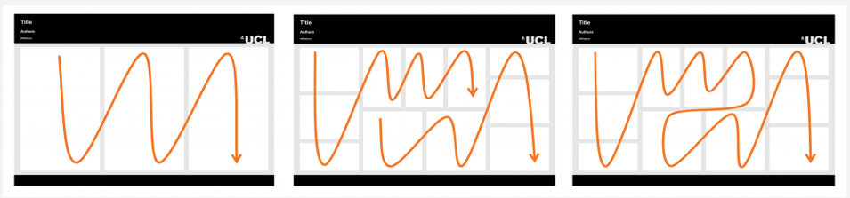

<!---Note this will remove itself:-->
<!---
permalink: /teaching/how_to_poster
title: How to give a great poster presentation
toc: true
--->

```{r setup}
knitr::opts_chunk$set(echo = TRUE)
getwd()
```

## Preamble

Giving a poster presentation at a conference is a great opportunity to get your work out there! Here's a workshop of helpful hints and tips to make up a great poster!

## Some resources

There is lots of advice out there:

1. A [great set of slides](https://www.bodleian.ox.ac.uk/sites/default/files/bodreader/documents/media/iskills-designing-conference-poster.pdf) from an outreach librarian at the Bod (very comprehensive)
2. UCL's [design guide](https://www.ucl.ac.uk/creative-services/printing-services/designing-your-poster) (advises UCL'ers to only use UCL colours but the webpage is beige)
3. University of Liverpool's [guide](https://www.liverpool.ac.uk/media/livacuk/computingservices/printing/making-an-impact-with-your-poster.pdf) (I particularly like their notes on graphs, text and colours)
4. Brief [guide](https://guides.nyu.edu/posters) from NYU

## Making a plan

### Audience

Before you start thinking too hard about what your poster will look like, consider your audience. Are they likely to:

- ...be academics? Or should your poster be accessible to industry representatives, public servants, etc.?  
*People who are not academics might have some surprising insights into your work - be prepared to translate your work to public health workers, policy-makers, or industry representatives*

- ...have clinical training? Have statistical training? Have some specialist knowledge relevant to the focus of the event your are presenting at?  
*Remember, at every global health conference there is a poor lost modeller (me) who has no idea about the physical/clinical/ecological details of your research that are important to you!*

### Layout

**Consider reading flow:**

Imagine you are reading your poster, or ask someone with fresh eyes to read it: does the natural order your audience reads your poster in match your expectation?



### Text

- Bite-size pieces of information are easier to digest than large chunks! 
- Consider organising the text of your poster into bullets,
- highlighting words that you want to **jump** off the page,
- and removing 90\% of all jargon!
  - For example, *I* know what the word *zoonotic* means in the context of *malaria*, but lots of people at a public health/applied maths/epidemiology conference may not! I'll use "*malaria that infects monkeys*" instead! And, of course, a *picture* of the zoonotic malaria transmission cycle ...

### Pictures


### Interactive elements

During a poster presentation, you only have a short window to catch the attention of your audience. You also have an advantage over giving an oral presentation: your audience can get right up close with your presentation! Interactive elements to a poster presentation can really increase audience engagement, and they don't need to be direct or obvious. My favourite poster presentations have involved chalk annotations over a mathematical model diagram, a spring attached to a poster to explain the forces involved between cells in a mathematical model of wound-healing, and a jar of sand to start a discussion about the dynamics of a landslide. I presented a [Shiny app](https://lucyharrison.shinyapps.io/pf_drug_resistance_shiny/) as a poster with animated buttons and sliders!

## Miscellaneous tips

- Don't forget to acknowledge co-authors/research groups/sponsors/grants involved in supporting your work (e.g., with a logo for a grant/sponsor)

- Include a QR code to your website/linkedIn/preprint - if your audience has bookmarked you, they're more likely to remember your research at a later date!

- Once you have a draft, **stand back!** Imagine your draft at A0 size, across the other end of Radcliffe square - what things in your poster stand out from far away? Does it send a clear message when a reader can only see the title, pictures, and maybe some sub-headings?

## Some examples

Here are some example posters from me + my friends :)

Let's discuss:

- Who is the audience of each of these posters?
- What do we think the poster is about when we look at it from a distance?
- How much reading time do we need to get the gist of the poster?
- What do these posters do well?
- Where could these posters improve?

## Conclusion

Hopefully now you're feeling confident and ready to whip up a great poster!

The University has a [print studio](https://estates.admin.ox.ac.uk/print-studio) which I think is available to students and staff!


