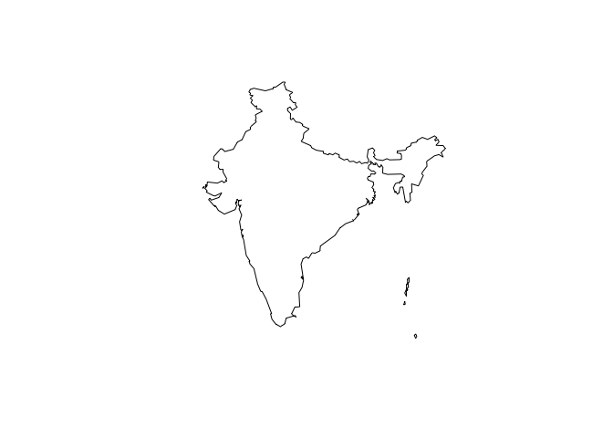
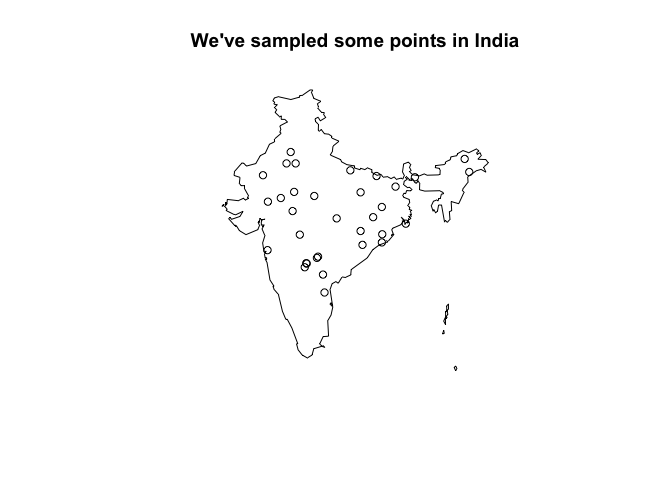
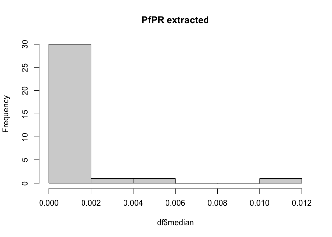

<!---Note this will remove itself:-->

---
permalink: /teaching/map_demo
title: A quick little guide for how to get into the MAP R package
toc: true
---

The Malaria Atlas Project (MAP) have made many of their great products
available through an R package, `malariaAtlas`. This means that if
you’re writing up some research that uses one of their products, your
code can call up MAP products directly without problems for data access
and reproducibility.

I don’t work for MAP but I’ve used lots of their stuff in my own
research and I’ve been asked on a number of occasions by colleagues for
help to use the MAP package - specifically to get at MAP’s estimates of
*Plasmodium falciparum* parasite rate in 2-10 year olds (PfPR),
described [here](https://doi.org/10.1016/S0140-6736(19)31097-9).

Here’s a link to the official MAP package vignette:

<https://github.com/malaria-atlas-project/malariaAtlas/blob/master/vignettes/overview.Rmd>

This has lots of detail related to all of the different features of the
package. I’m not trying to recreate that here!

But, if you’re specifically trying to get at PfPR (or another MAP
surface) for a couple of points/countries, here’s a short demonstration
to get you started.

## Bring in packages

``` r
library(malariaAtlas)
library(sf)
library(terra)
library(tidyverse)
library(viridisLite)
```

## Bring in (country) shapes and check available rasters

Rasters == gridded datasets/model predictions provided by MAP.

In this example, I’m looking at India. I specify the admin level (zero
== national) - this could be smaller, or I could ask the MAP package for
data for multiple countries at a time.

``` r
ind_shp <- getShp(ISO = "IND", admin_level = "admin0") %>%
  suppressMessages()
```

    ## Start tag expected, '<' not found
    ## Start tag expected, '<' not found

``` r
ind_shp %>%
  st_simplify(dTolerance = 0.1) %>%
  st_geometry() %>%
  plot() %>%
  suppressWarnings()
```

<!-- -->

If you wanted to grab data for a whole continent, say Africa, you could
grab your shape from elsewhere:

``` r
library(rnaturalearth)
library(rnaturalearthdata)
world <- ne_countries(scale="medium", returnclass = "sf")

afr <- world %>%
  filter(continent == "Africa") %>%
  vect() %>%
  crop(ext(-21, 63, -35, 37))

afr %>%
  st_as_sf() %>%
  st_geometry() %>%
  plot()
```

Here’s a snippet to check which rasters MAP has available to us:

``` r
# all_dat is a list of available rasters
all_dat = malariaAtlas::listRaster(printed = FALSE)
```

    ## Downloading list of available rasters...

``` r
# let's see if we can find Pf parasite rate .....
all_dat$dataset_id[grep("PfPR", all_dat$dataset_id)]
```

    ## [1] "Explorer__2020_Global_PfPR" "Explorer__2019_Global_PfPR"

``` r
# I had thought that there was PfPR up to 2022?
all_dat[all_dat$dataset_id == "Explorer__2020_Global_PfPR",]
```

    ##                     dataset_id version               raster_code
    ## 108 Explorer__2020_Global_PfPR    2020 Explorer:2020_Global_PfPR
    ##                                           title
    ## 108 Plasmodium falciparum PR2 - 10 version 2020
    ##                                                                 title_extended
    ## 108 Plasmodium falciparum parasite rate in 2-10 year olds globally, 2000-2019.
    ##                                                                                                                                                                                                                                                                                                                                                                                                                                                                                                                                                                                                                                 abstract
    ## 108 MAP tries to publish the most up-to-date version of our results. Please contact us if you have questions related to versioning.\r\nThis layer is a time-aware mosaic data set showing predicted age-standardised parasite rate for Plasmodium falciparum malaria for children two to ten years of age (PfPR2-10) for each year.\r\n\r\nNote the colour scaling is split to better differentiate within low endemic areas, with one linear scale between zero and 0.01 PfPR2-10 (grey shades) and a second linear scale between 0.01 and 1 (colours from blue to red).\r\n\r\nPlease see our malaria burden page for further details.
    ##     min_raster_year max_raster_year
    ## 108            2000            2019

``` r
# years available 2000-2019

# in fact, I was grepping the wrong thing:
all_dat$dataset_id[grep("Pf_Parasite_Rate", all_dat$dataset_id)]
```

    ## [1] "Malaria__202206_Global_Pf_Parasite_Rate"
    ## [2] "Malaria__202406_Global_Pf_Parasite_Rate"
    ## [3] "Malaria__202508_Global_Pf_Parasite_Rate"

``` r
all_dat[all_dat$dataset_id == "Malaria__202406_Global_Pf_Parasite_Rate",]
```

    ##                                 dataset_id version
    ## 20 Malaria__202406_Global_Pf_Parasite_Rate  202406
    ##                               raster_code
    ## 20 Malaria:202406_Global_Pf_Parasite_Rate
    ##                                                                                                                        title
    ## 20 Proportion of Children 2 to 10 years of age showing, on a given year, detectable Plasmodium falciparum parasite 2000-2022
    ##    title_extended
    ## 20             NA
    ##                                                                                                                                                                                                                                                                                                                                                                                                                                                                                                                                                                                                                                                                                                                                                                                                                                                                                                                                                                                                          abstract
    ## 20 This layer map provides estimates of the proportion of children 2 to 10 years of age (PfPR2-10) showing detectable Plasmodium falciparum parasite. To produce these estimates, we apply geostatistical models to response datasets consisting of PR points and routine surveillance reports, and a rich set of geospatial covariates that characterise habitat for Anopheles mosquitos that spread the disease. The maps cover all malaria-endemic countries and are produced annually from year 2000 at a 5x5 km resolution.\r\n\r\nThe rasters may be downloaded as a series of multi-band GeoTiffs. The first band consists of the modelled estimates as rates per person [0-1]. The second band is a mask consisting of the values zero and 1; the 1 values represent pixels that we mask out because they are sparsely populated. This masking is only applied to South America, and we define "sparsely populated" as areas that have a modelled estimate of >0 and a population of ≤5 people per pixel.
    ##    min_raster_year max_raster_year
    ## 20            2000            2022

``` r
# for example, these might be years we're interested in:
pfpr_years <- 2015:2022
```

## Download rasters and extract values

Once we’ve picked a raster to download, here’s the code to do the
download:

``` r
pfpr <- malariaAtlas::getRaster("Malaria__202406_Global_Pf_Parasite_Rate",
                                shp = ind_shp,
                                year = pfpr_years) %>%
  suppressMessages() # which gives me a SpatRasterCollection

pfpr <- as.list(pfpr) %>%
          rast() %>%
          suppressMessages()

writeRaster(pfpr, "pfpr_rasters_ind.tif")
```

``` r
pfpr <- rast("pfpr_rasters_ind.tif")
```

Let’s make up some locations (in space and time) in India:

``` r
pts <- terra::spatSample(pfpr[[1]], size = 100, method = "random", xy = TRUE)
# drop points that don't have values in our raster (e.g., ocean/neighbouring country)
pts <- pts[!is.na(pts[,3]), 1:2]
# randomly assign some years:
pts$year <- sample(pfpr_years, nrow(pts), replace = TRUE)

# and have a look:
head(pts)
```

    ##           x         y year
    ## 2  75.85417 15.895835 2017
    ## 8  78.35417 22.520835 2015
    ## 15 73.77083 17.770835 2016
    ## 16 81.31250 16.854168 2016
    ## 26 77.85417  8.604168 2015
    ## 28 76.89583 23.729168 2017

``` r
ind_shp %>%
  st_simplify(dTolerance = 0.1) %>%
  st_geometry() %>%
  plot(main="We've sampled some points in India") %>%
  suppressWarnings()
points(pts$x, pts$y)
```

<!-- -->

and here’s the code to extract values from the rasters at locations in
the dataset:

``` r
# remove some extra rasters we don't need for this:
pfpr <- pfpr[[-c(which(names(pfpr) == "Mask: Sparsely Populated"))]]

library(stringr)
names(pfpr) <- ifelse(grepl("Proportion of Children 2", names(pfpr)),
                      paste0(str_sub(names(pfpr), -4), "_median"),
                      ifelse(str_sub(names(pfpr), -1) == "4",
                        paste0(str_sub(names(pfpr), 41, 44), "_upper"),
                        paste0(str_sub(names(pfpr), 41, 44), "_lower")))

extract_pfpr <- function(pfpr, pts, yr){
  # a function to extract pfpr for a specific year, `yr`
  
  idx <- which(pts$year == yr)
  
  # can't grep on the yr by itself which is a pain - have renamed lyrs above
  pfpr <- pfpr[[grep(yr, names(pfpr))]]
  out <- terra::extract(pfpr, pts[idx, c("x", "y")], ID=FALSE)
  
  # I *think* the second and third surfaces are lower and upper bounds ..
  names(out) <- c("median", "lower", "upper")
  cbind(out, pts[idx,])
}

df <- do.call(rbind, lapply(pfpr_years, function(yr){extract_pfpr(pfpr, pts, yr)}))

write.csv(pts, "pts_with_pfpr.csv", row.names = FALSE)
```

## Have a look at what we’ve grabbed

``` r
ind_shp %>%
  st_simplify(dTolerance = 0.1) %>%
  st_geometry() %>%
  plot(main = "We've associated our points with PfPR values") %>%
  suppressWarnings()
points(df$x, df$y, col = viridis(10)[cut(log10(df$median), breaks=10)], pch=16)
```

<!-- -->

``` r
# i should really put a scale here but that's all for now!
```
