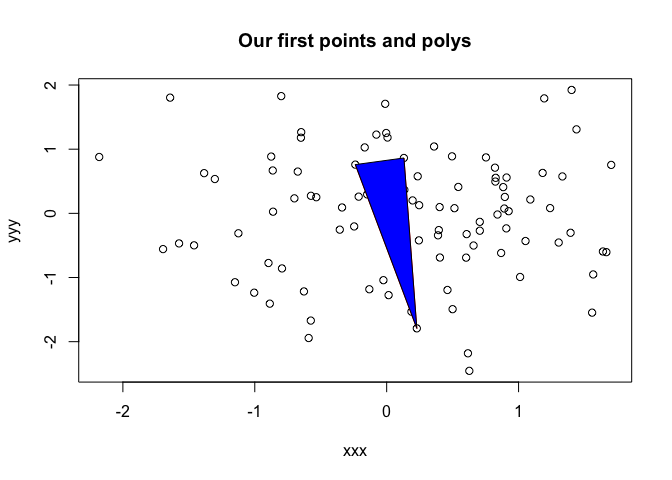
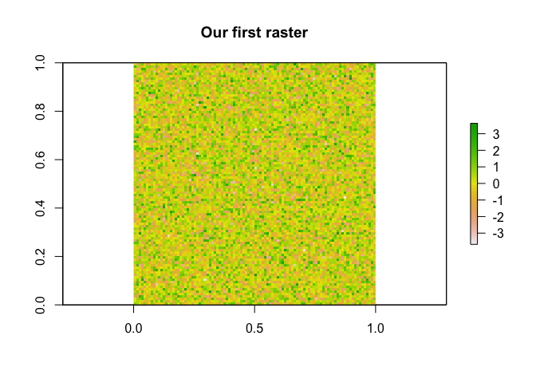
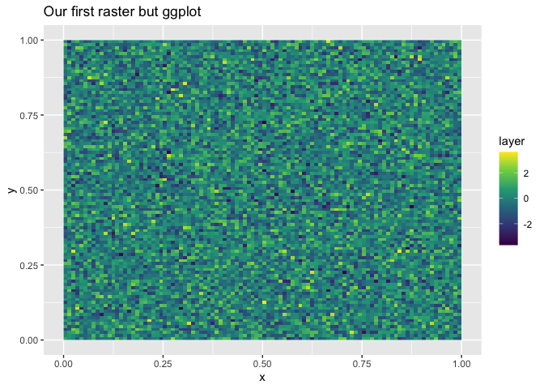
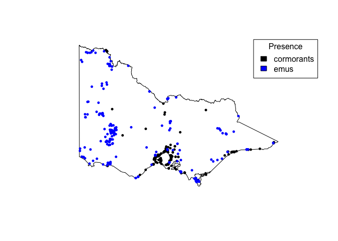
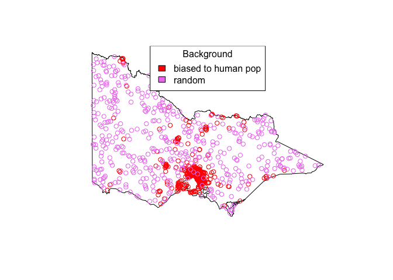
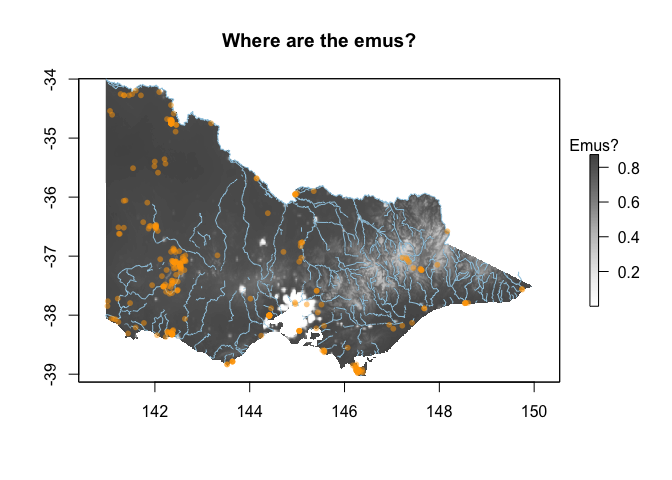
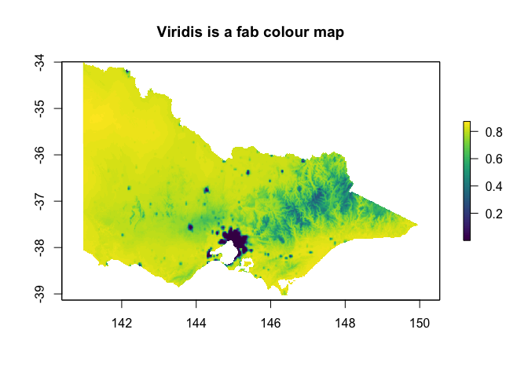
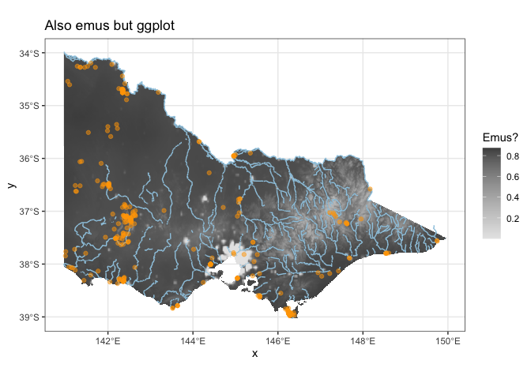

Lucy Harrison

2025-01-29

## Preamble

Hello! Here’s an introduction to **mapping in R**. In this workshop, we
will:

- Learn about types of spatial data
- Learn about packages that give us access to open source environmental
  data in R
- Learn about key operations for manipulating spatial data in R
- Learn about `rgbif`, a package for accessing the Global Biodiversity
  Information Facility (GBIF), a global, open source dataset of species
  occurrence

I wrote this workshop for IDDO’s R practical session. The intended
audience for the workshop was R beginners (if you know the difference
between the console and the terminal then you’re not a beginner any
more!), but I haven’t provided as much written content as is needed for
this to be particularly useful. Either way, I’m popping it here for now
and will probably come back to it in future when the need arises.

## Resources

Today I’m working from/plagiarising the following useful resources:

1.  Spatial data with R and `terra` (<https://rspatial.org/index.html>)
2.  Spatial statistics for data science: theory and practice with R
    (<https://www.paulamoraga.com/book-spatial/index.html>)
3.  Introduction to visualising spatial data in R
    (<https://cran.r-project.org/doc/contrib/intro-spatial-rl.pdf>)
4.  A very brief introduction to species distribution modelling in R
    (<https://jcoliver.github.io/learn-r/011-species-distribution-models.html>)
5.  How to (quickly) enrich a map with natural and anthropic details
    (<http://francescobailo.net/2018/08/how-to-quickly-enrich-a-map-with-natural-and-anthropic-details/>)

## Useful packages

``` r
library(raster)  # for bread and butter
```

    ## Loading required package: sp

``` r
library(terra)  # masks lots of the functionality in `raster`
```

    ## terra 1.8.42

``` r
library(sf)  # replaces lots of the functionality in `sp`
```

    ## Linking to GEOS 3.11.0, GDAL 3.5.3, PROJ 9.1.0; sf_use_s2() is TRUE

``` r
library(ggplot2)  # some say this is required to make nice maps in R .. not I!
library(ggmap)  # extends ggplot for maps
```

    ## ℹ Google's Terms of Service: <https://mapsplatform.google.com>
    ##   Stadia Maps' Terms of Service: <https://stadiamaps.com/terms-of-service/>
    ##   OpenStreetMap's Tile Usage Policy: <https://operations.osmfoundation.org/policies/tiles/>
    ## ℹ Please cite ggmap if you use it! Use `citation("ggmap")` for details.

    ## 
    ## Attaching package: 'ggmap'

    ## The following object is masked from 'package:terra':
    ## 
    ##     inset

``` r
library(dplyr)
```

    ## 
    ## Attaching package: 'dplyr'

    ## The following objects are masked from 'package:terra':
    ## 
    ##     intersect, union

    ## The following objects are masked from 'package:raster':
    ## 
    ##     intersect, select, union

    ## The following objects are masked from 'package:stats':
    ## 
    ##     filter, lag

    ## The following objects are masked from 'package:base':
    ## 
    ##     intersect, setdiff, setequal, union

``` r
library(tidyr)
```

    ## 
    ## Attaching package: 'tidyr'

    ## The following object is masked from 'package:terra':
    ## 
    ##     extract

    ## The following object is masked from 'package:raster':
    ## 
    ##     extract

``` r
library(tidyverse)
```

    ## ── Attaching core tidyverse packages ──────────────────────── tidyverse 2.0.0 ──
    ## ✔ forcats   1.0.0     ✔ readr     2.1.5
    ## ✔ lubridate 1.9.4     ✔ stringr   1.5.1
    ## ✔ purrr     1.0.4     ✔ tibble    3.3.0

    ## ── Conflicts ────────────────────────────────────────── tidyverse_conflicts() ──
    ## ✖ tidyr::extract() masks terra::extract(), raster::extract()
    ## ✖ dplyr::filter()  masks stats::filter()
    ## ✖ dplyr::lag()     masks stats::lag()
    ## ✖ dplyr::select()  masks raster::select()
    ## ℹ Use the conflicted package (<http://conflicted.r-lib.org/>) to force all conflicts to become errors

## Types of spatial data

There are a couple of different types of data:

- vector data
  - points
  - lines (and networks)
  - polygons
- raster data

All types come with their own things to think about!

See <https://rspatial.org/spatial/2-spatialdata.html>

(If you would rather see the plot in the Viewer pane, go to RStudio \>
Preferences \> R Markdown and unselect “Show output inline for all R
Markdown documents”)

``` r
xxx <- rnorm(100)
yyy <- rnorm(100)

plot(xxx, yyy, main="Our first points and polys")

sel <- sample(100, 3)

lines(xxx[sel], yyy[sel], col="red")

polygon(xxx[c(sel, sel[1])], yyy[c(sel, sel[1])], col="blue")
```

<!-- -->

``` r
?raster # have a look at some of the arguments here

ras <- rnorm(10000) %>%
  matrix(100, 100) %>%
  raster()

plot(ras, main="Our first raster")
```

<!-- -->

(I have contempt for ggplot but here it is: )

``` r
df = data.frame(x = xxx, y = yyy)

ggplot() +
  geom_point(data = df, aes(x, y)) +
  geom_polygon(data = df[c(sel, sel[1]),], aes(x, y), fill="blue") +
  labs(title = "Our first points and polys but ggplot")
```

<!-- -->

``` r
ggplot(rasterToPoints(ras)) + # this is rather silly !!
  geom_raster(aes(x = x, y = y, fill = layer)) +
  scale_fill_viridis_c() +
  labs(title = "Our first raster but ggplot")
```

<!-- -->

## Data for case studies

### Shapes

Here are some polygons in the wild:

``` r
library(geodata)
aus <- gadm("AUS", level = 1, path="~/Desktop/")

aus
```

    ##  class       : SpatVector 
    ##  geometry    : polygons 
    ##  dimensions  : 11, 11  (geometries, attributes)
    ##  extent      : 112.9211, 159.1092, -55.11694, -9.142176  (xmin, xmax, ymin, ymax)
    ##  coord. ref. : lon/lat WGS 84 (EPSG:4326) 
    ##  names       :   GID_1 GID_0   COUNTRY          NAME_1 VARNAME_1 NL_NAME_1
    ##  type        :   <chr> <chr>     <chr>           <chr>     <chr>     <chr>
    ##  values      : AUS.1_1   AUS Australia Ashmore and Ca~        NA        NA
    ##                AUS.2_1   AUS Australia Australian Cap~        NA        NA
    ##                AUS.3_1   AUS Australia Coral Sea Isla~        NA        NA
    ##     TYPE_1 ENGTYPE_1  CC_1 HASC_1  ISO_1
    ##      <chr>     <chr> <chr>  <chr>  <chr>
    ##  Territory Territory    12  AU.AS     NA
    ##  Territory Territory     8  AU.AC AU-ACT
    ##  Territory Territory    11  AU.CR     NA

Make sure you change the path argument above! Try changing the iso code
to another country! Have a look at the directory where our polygon is
saved: `geodata` has provided us with an `.rds` of SpatVectors (from
`terra`) for Australia. Let’s get these into `sf` formats and simplify
them down a little …

``` r
aus$NAME_1
```

    ##  [1] "Ashmore and Cartier Islands"  "Australian Capital Territory"
    ##  [3] "Coral Sea Islands Territory"  "Jervis Bay Territory"        
    ##  [5] "New South Wales"              "Northern Territory"          
    ##  [7] "Queensland"                   "South Australia"             
    ##  [9] "Tasmania"                     "Victoria"                    
    ## [11] "Western Australia"

``` r
aus <- aus %>%
  st_as_sf()

aus <- aus[c(2,5:11),] # I thought I could do this with a slice()?

plot(st_geometry(st_simplify(aus, dTolerance=1000)))  # dTolerance is in metres !
```

<!-- -->

``` r
# zoom into Vic for fun
vic <- aus %>%
  filter(NAME_1 == "Victoria") %>%
  st_simplify(dTolerance = 1000)

plot(st_geometry(vic))
```

<!-- -->

### Surfaces

#### Elevation

Let’s meet some *raster* data in the wild! The `elevatr` package lets us
access global elevation data.

``` r
library(elevatr)
```

    ## elevatr v0.99.0 NOTE: Version 0.99.0 of 'elevatr' uses 'sf' and 'terra'.  Use 
    ## of the 'sp', 'raster', and underlying 'rgdal' packages by 'elevatr' is being 
    ## deprecated; however, get_elev_raster continues to return a RasterLayer.  This 
    ## will be dropped in future versions, so please plan accordingly.

``` r
vic_elevation <- get_elev_raster(vic, z = 6) # z is zoom ... may need to adjust
```

    ## Mosaicing & Projecting

    ## Note: Elevation units are in meters.

``` r
vic_elevation # have a look at all of the information associated with our raster
```

    ## class      : RasterLayer 
    ## dimensions : 906, 1129, 1022874  (nrow, ncol, ncell)
    ## resolution : 0.009960519, 0.009960519  (x, y)
    ## extent     : 140.625, 151.8704, -40.97639, -31.95216  (xmin, xmax, ymin, ymax)
    ## crs        : +proj=longlat +datum=WGS84 +no_defs 
    ## source     : file481c6dec67b1.tif 
    ## names      : file481c6dec67b1

``` r
plot(vic_elevation, main="Elevation in metres")
plot(st_geometry(vic), add = TRUE, border = "blue")
```

<!-- -->

The map we’ve just made is a little hard to read: we can’t tell the
difference between ocean pixels and land pixels. To remove ocean pixels,
we’ll need to *mask* and *crop* our raster.

``` r
vic_elevation_masked <- mask(vic_elevation, vic) %>%
  crop(vic) # see what happens without the crop first :)

plot(vic_elevation_masked, main="Elevation in metres")
plot(st_geometry(vic), add=TRUE, border="blue")
```

<!-- -->

``` r
# This picture looks rather different !
```

But wait a second! What if I want to be able to see what’s happening in
my raster near the land borders? Not to worry! We can *buffer* and
*trim*!

``` r
# First let's have a look at a buffered polygon ...
vic_buffered <- st_buffer(vic, 25000)
plot(vic_elevation_masked, main="Elevation in metres")
plot(st_geometry(vic), add=TRUE, border="blue")
plot(st_geometry(vic_buffered), add=TRUE, border="red")
```

<!-- -->

``` r
# Mask elevation raster with all of Australia first (to remove ocean pixels)
vic_elevation_buffered <- mask(vic_elevation, aus) %>%
  mask(vic_buffered) %>% # Then mask with buffered Vic
  trim()

plot(vic_elevation_buffered) # note the fun little hole where the polygons don't quite overlap :)
plot(st_geometry(vic_buffered), add=TRUE, border="red")
plot(st_geometry(vic), add=TRUE, border="blue")
```

<!-- -->

#### Distance from river / city

``` r
library(rnaturalearth)
library(rnaturalearthdata)
```

    ## 
    ## Attaching package: 'rnaturalearthdata'

    ## The following object is masked from 'package:rnaturalearth':
    ## 
    ##     countries110

``` r
rivers <- ne_download(scale =  10, type = 'rivers_lake_centerlines', 
                      category = 'physical', returnclass = "sf")
```

    ## Reading layer `ne_10m_rivers_lake_centerlines' from data source 
    ##   `/private/var/folders/d3/y1ry00t94rbg0nbfhc8z23p80000gr/T/RtmpG5oP69/ne_10m_rivers_lake_centerlines.shp' 
    ##   using driver `ESRI Shapefile'
    ## Simple feature collection with 1473 features and 38 fields
    ## Geometry type: MULTILINESTRING
    ## Dimension:     XY
    ## Bounding box:  xmin: -164.9035 ymin: -52.15775 xmax: 177.5204 ymax: 75.79348
    ## Geodetic CRS:  WGS 84

``` r
aus_rivers <- rivers %>%
  st_crop(aus)
```

    ## Warning: attribute variables are assumed to be spatially constant throughout
    ## all geometries

``` r
plot(st_geometry(st_simplify(aus, dTolerance=1000)))
plot(st_geometry(rivers), col="blue", add=TRUE) # lol I've picked up In Zid
```

<!-- -->

``` r
# I would like more rivers !

library(osmdata)
```

    ## Data (c) OpenStreetMap contributors, ODbL 1.0. https://www.openstreetmap.org/copyright

``` r
osm_rivers <- opq(bbox = st_bbox(vic)) %>%
  add_osm_feature(key = 'waterway', value = 'river') %>%
  osmdata_sf()

osm_rivers <- osm_rivers$osm_lines %>%
  st_simplify(dTolerance = 1000)

osm_rivers <- filter(osm_rivers, !st_is_empty(osm_rivers))

plot(vic_elevation_buffered)
plot(st_geometry(osm_rivers), add=TRUE, col="blue")
```

<!-- -->

A very handy modelling covariate can be *distance from a watercourse* -
let’s cheekily do that with `terra`:

``` r
dist_to_rivers <- vic_elevation

rivers <- vect(osm_rivers)
ras <- rast(rivers, res = 0.02) #res(vic_elevation)) # erm .. turn this down and turn it into a teaching moment on raster projection
ras <- rasterize(rivers, ras) %>%
  crop(vic_elevation_masked)
dist <- distance(ras)

dist_to_rivers <- dist %>%
  raster() %>%
  projectRaster(vic_elevation_masked) %>%
  mask(vic_elevation_masked)

plot(dist_to_rivers)
plot(st_geometry(vic), add=TRUE, border="blue")
```

<!-- -->

``` r
# if you're interested in comparing rasters:
# plot(vic_elevation_masked, dist_to_rivers)
```

(see
<https://stackoverflow.com/questions/77614574/how-do-i-create-a-raster-of-distance-to-nearest-feature-using-the-terra-sf-r-pac>)

We can do the same thing to figure out distance from the coast:

``` r
ras <- vic_elevation %>%
  mask(aus)
values(ras) <- ifelse(is.na(values(ras)), 1, NA)

plot(ras)
```

<!-- -->

``` r
dist <- ras %>%
  aggregate(fact = 2) %>%
  rast() %>%
  distance()

plot(dist)
```

<!-- -->

``` r
dist_to_coast <- dist %>%
  raster() %>%
  projectRaster(vic_elevation_masked) %>%
  crop(vic_elevation_masked) %>%
  mask(vic_elevation_masked)
  
plot(dist_to_coast)
```

<!-- -->

#### Human population density

Finally let’s grab a raster of human population density for good
measure:

``` r
library(geodata)
hpop <- population(year = 2020, res = 2.5, path = tempdir())

hpop <- hpop %>%
  raster() %>%
  crop(vic_elevation_buffered) %>%
  projectRaster(vic_elevation_masked) %>%
  mask(vic_elevation_masked)

plot(hpop)
```

<!-- -->

### Points: species occurrence

So now we’re raster pros! Let’s grab some point data and compare it to
our environmental surfaces …

``` r
library(rgbif)

vic_wkt <- vic_buffered %>%
  st_simplify(dTolerance = 10000) %>%
  st_geometry() %>%
  st_as_text()

emus <- occ_search(scientificName = "Dromaius novaehollandiae",
                         country = "AU",
                         hasCoordinate = TRUE,
                         hasGeospatialIssue = FALSE,
                         geometry = vic_wkt)

emus <- st_as_sf(emus$data, 
                 coords = c("decimalLongitude", "decimalLatitude"),
                 crs = st_crs(vic))

emus <- filter(emus, 
               st_intersects(emus, vic, sparse=FALSE)[,1]) # just keep the ones in Victoria

cormorants <- occ_search(scientificName = "Phalacrocorax varius",
                         country = "AU",
                         hasCoordinate = TRUE,
                         hasGeospatialIssue = FALSE,
                         geometry = vic_wkt)
  
cormorants <- st_as_sf(cormorants$data, 
                       coords = c("decimalLongitude", "decimalLatitude"),
                       crs = st_crs(vic))

cormorants <- filter(cormorants,
                     st_intersects(cormorants, vic, sparse = FALSE)[,1])

plot(st_geometry(vic))
points(cormorants)
points(emus, col="blue")
legend("topright", fill=c("black", "blue"), c("cormorants", "emus"), title="Presence")
```

<!-- -->

## A crap model

All of this to say I’ve been itching for some linear regression!

``` r
pseudo_absences <- rasterToPoints(hpop) %>%
  data.frame() %>%
  mutate(hpop = population_density / sum(population_density))

# There's definitely existing functions to do this ... but now I'm hurrying
# see raster::sampleRandom() ... it doesn't have an option for probs
pseudo_absences_biased <- pseudo_absences[sample(x = 1:nrow(pseudo_absences), 
                                          size = nrow(emus),  
                                          prob = pseudo_absences$hpop),]

pseudo_absences_random <- pseudo_absences[sample(x = 1:nrow(pseudo_absences), 
                                          size = nrow(emus)),]
plot(st_geometry(vic))
points(pseudo_absences_biased, col="red")
points(pseudo_absences_random, col="violet")
legend("top", fill=c("red", "violet"), c("biased to human pop", "random"), title="Background")
```

<!-- -->

Let’s fit a model ! (<https://rspatial.org/sdm/5_sdm_models.html>)

``` r
emus_pa <- rbind(emus %>%
                st_coordinates() %>%
                as.data.frame() %>%
                rename(x = X, y = Y) %>%
                mutate(pa = 1),
              pseudo_absences_biased %>%
                dplyr::select(x, y) %>%
                mutate(pa = 0))

covs_stack <- stack(hpop, dist_to_coast, dist_to_rivers, vic_elevation_masked)
names(covs_stack) <- c("hpop", "dist_to_coast", "dist_to_rivers", "elevation")
plot(covs_stack)
```

<!-- -->

``` r
emus_pa <- cbind(emus_pa, raster::extract(covs_stack, emus_pa[,c("x", "y")]))

# Alternatively ...
# emus_pa$population_density <- raster::extract(hpop, emus_pa[,c("x","y")])
# emus_pa$dist_to_coast <- raster::extract(dist_to_coast, emus_pa[,c("x","y")])
# emus_pa$dist_to_rivers <- raster::extract(dist_to_rivers, emus_pa[,c("x","y")])
# emus_pa$elevation <- raster::extract(vic_elevation_masked, emus_pa[,c("x","y")])

m <- glm(pa ~ hpop + dist_to_coast + dist_to_rivers + elevation, 
         data = emus_pa,
         family = binomial())

class(m)
```

    ## [1] "glm" "lm"

``` r
summary(m)
```

    ## 
    ## Call:
    ## glm(formula = pa ~ hpop + dist_to_coast + dist_to_rivers + elevation, 
    ##     family = binomial(), data = emus_pa)
    ## 
    ## Coefficients:
    ##                  Estimate Std. Error z value Pr(>|z|)    
    ## (Intercept)     1.747e+00  1.795e-01   9.737  < 2e-16 ***
    ## hpop           -5.462e-03  5.299e-04 -10.308  < 2e-16 ***
    ## dist_to_coast  -1.515e-07  9.542e-07  -0.159  0.87381    
    ## dist_to_rivers  2.659e-06  1.071e-05   0.248  0.80384    
    ## elevation      -1.502e-03  5.023e-04  -2.991  0.00278 ** 
    ## ---
    ## Signif. codes:  0 '***' 0.001 '**' 0.01 '*' 0.05 '.' 0.1 ' ' 1
    ## 
    ## (Dispersion parameter for binomial family taken to be 1)
    ## 
    ##     Null deviance: 1213.00  on 874  degrees of freedom
    ## Residual deviance:  626.44  on 870  degrees of freedom
    ##   (3 observations deleted due to missingness)
    ## AIC: 636.44
    ## 
    ## Number of Fisher Scoring iterations: 8

``` r
m
```

    ## 
    ## Call:  glm(formula = pa ~ hpop + dist_to_coast + dist_to_rivers + elevation, 
    ##     family = binomial(), data = emus_pa)
    ## 
    ## Coefficients:
    ##    (Intercept)            hpop   dist_to_coast  dist_to_rivers       elevation  
    ##      1.747e+00      -5.462e-03      -1.515e-07       2.659e-06      -1.502e-03  
    ## 
    ## Degrees of Freedom: 874 Total (i.e. Null);  870 Residual
    ##   (3 observations deleted due to missingness)
    ## Null Deviance:       1213 
    ## Residual Deviance: 626.4     AIC: 636.4

And make some predictions …

``` r
logit_preds <- predict(m, as.data.frame(covs_stack))
prob_preds <- 1 / (1 + exp(-logit_preds))

out <- hpop
values(out) <- prob_preds
```

Let’s bundle it all into a plot:

``` r
vic_rivers <- st_as_sf(rivers)

vic_rivers <- filter(vic_rivers,
                     st_intersects(vic_rivers, vic, sparse = FALSE)[,1])

library(RColorBrewer)
display.brewer.all()
```

<!-- -->

``` r
pal <- brewer.pal(9, "Greys")[1:7] %>% # take some of the darker greys out
  colorRampPalette()

library(scales)
```

    ## 
    ## Attaching package: 'scales'

    ## The following object is masked from 'package:purrr':
    ## 
    ##     discard

    ## The following object is masked from 'package:readr':
    ## 
    ##     col_factor

    ## The following object is masked from 'package:terra':
    ## 
    ##     rescale

``` r
plot(out, main="Where are the emus?", col = pal(100), legend.args=list("Emus?"))
plot(st_geometry(vic_rivers), col='#9ecae1', add=TRUE)
plot(st_geometry(emus), col=alpha("orange", 0.5), add=TRUE, pch=16, cex=0.8)
```

<!-- -->

``` r
library(viridisLite)
?viridis
plot(out, col=viridis(100), main="Viridis is a fab colour map")
```

<!-- -->

There are some reasons why we should doubt this map of where the emus
are!

Could you fit a new model using the biased background data? Which of the
models is likely more useful?

And here’s some info on where the emus are:
<https://www.wildlife.vic.gov.au/__data/assets/pdf_file/0025/91384/Emu.pdf>

If you would really like to fancy it up, there’s always ggplot:

``` r
ggplot(rasterToPoints(out)) +
  geom_raster(aes(x=x, y=y, fill=population_density)) +
  scale_fill_gradientn(colours = rev(grey.colors(100))) +
  geom_sf(data = vic_rivers, aes(geometry=geometry), colour = '#9ecae1') +
  geom_sf(data = emus, colour = "orange", alpha=0.5) +
  labs(title="Also emus but ggplot", fill="Emus?") +
  theme_bw()
```

<!-- -->

## Some Rules for mapping (read: Rules for Life)

We’ve all seen a bad map! How did we know it was bad?

- Weird colours are hard to interpret! Try colour brewer
  (<https://colorbrewer2.org/#type=sequential&scheme=BuGn&n=3>)
- Colour-blind accessibility! Try colour oracle
  (<https://colororacle.org>) and have a look at what happens to the
  base graphics default palette (e.g., `plot(vic_elevation_masked)`)
- Dark colours mean more of the thing; red is hot and blue is cold;
  water should be blue and things that aren’t water shouldn’t be blue;
  yada yada
- Viridis color maps are often helpful
  (<https://cran.r-project.org/web/packages/viridis/vignettes/intro-to-viridis.html>)
  but don’t overuse !

## Conclusion

That’s all for today! We have learned:

- What the types of spatial data are, including points, polygons and
  rasters
- How to fenangle spatial data, including cropping, masking, trimming
  and projecting
- How to visualise spatial data in R base graphics (and ggplot)
- How to grab spatial data from a couple of different places, including
  elevatr and gbif
- How to fit a logistic regression model to presence/background data and
  make predictions
- Some basic rules for visualising spatial data
