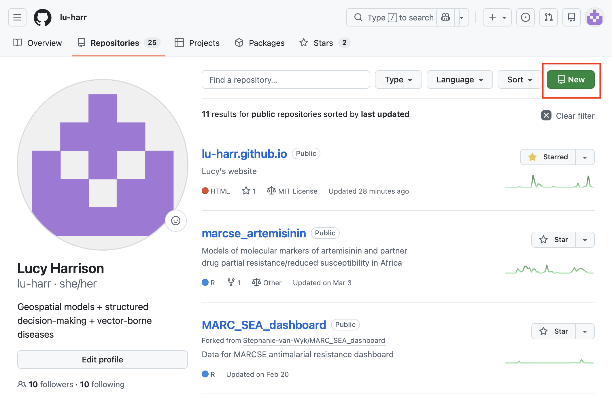

<!---
permalink: /teaching/version_control
title: Intro to version control with git and GitHub
categories:
  - howto
tags:
  - R
toc: true
author_profile: false
--->

```{r setup, include=FALSE}
knitr::opts_chunk$set(echo = TRUE)
```

## Preamble

This a workshop I wrote for IDDO's coding club to introduce complete beginners to version control with git and the many pros to using GitHub. During this workshop, we will:

- Learn how to initialise a local repository, how to make commits, and how to go back to past versions of our repo
- Learn how to push our repository to GitHub, how to fork a GitHub repository, and how to collaborate through pull requests
- Learn some other neat features of GitHub, such as Overleaf integration and github.io!

This workshop is for **absolute beginners**. Version control is confusing! Once you've got through the basics, here are some resources for different skills levels:

- git is my lab book
- and of course, your friendly neighbourhood LLM is absolutely welcome :)

To complete this workshop, we'll assume you have git on your machine and that you have an account set up on GitHub.

## Before we get started: the command line

Today, we'll be driving git using *the command line*. In RStudio (or whichever IDE you're using), navigate to the *Terminal* window. Welcome to the command line. Some useful commands:

- `pwd`: print working directory
- `cd`: change directories
- `mkdir`: make directory
- `mv`: move (a file or files from one location to another)
- `cp`: copy (a file or files from one location to another)
- `ls`: list all files in a directory
- `less`: view the contents of a file
- `man`: show the *manual* for a command, with all the different options associated with it, e.g. `man ls`

If you're unfamiliar, let's have a quick play around with these. CMD/A and CMD/E are my favourite command line shortcuts. There are lots of other commands and interesting ways to use them but we'll move on for now!

## Version control: why are we here?

Have you ever found yourself hours or days into a change to a coding or stats project, only to realise you need to go back? 

It's times like these when **version control** can be very powerful! By tracking your progress on your code you can:

- go back to specific versions of your code
- track your progress with annotations on each major change to your code
- try out new additions of your code without losing a stable version of it
- (and, with a platform like GitHub, allow other people to track your progress)

One widely-used system for version control is [**git**](https://en.wikipedia.org/wiki/Git). 

## Our first repository

To make your first repository, navigate to the directory where you would like it to be located.

<div class="notice--primary" markdown="1">
**Repository** 
AKA "repo": think of this as a folder where all your code and other stuff goes. Each repo is a self-contained unit for a single project.
<ul>
<li>"Local" repository: the version of your repo on your computer.</li>
<li>"Remote" repository: the version of your repo on GitHub, for example.</li>
</ul>
</div>

Like so:

```sh
mkdir best_project  # for example
cd best_project  
git init
```

You can check that you have successfully initialised your repo by checking its *status*:

```sh
git status
```

## Our first commit

There's nothing in our repo yet! Let's add a README. This command creates a file called `README.txt` and puts some text in it

```sh
echo "a very nice readme" > README.txt
```

Check the status of your repo again. I get:

```sh
On branch main

No commits yet

Untracked files:
  (use "git add <file>..." to include in what will be committed)
	README.txt

nothing added to commit but untracked files present (use "git add" to track)
```

This tells a couple of important things. We'll get to branches later, but importantly, the status message tells us the repo has *no commits yet*. Let's remedy that!

<div class="notice--primary" markdown="1">
**Commit** 
A discrete change to your repository. Each commit is a snapshot of the repository. Commits are a two-step process:
<ol>
<li>Add files to *staging area*. (Or, prepare your snapshot.)</li>
<li>Commit! (Take a photo!)</li>
</ol>
</div>

To add files to the staging area, we can use `add`:

```sh
git add README.txt
```

Check your repo's status again. Has the README made it to the staging area?

Now commit:

```sh
git commit -m "my first commit"
```

The text that follows `-m` is the **commit message**. We write this ourselves to give a human-readable description of changes in the new commit.

The commit message is more important than you might think! Use it to track your own progress as you write your code: what are the key changes in each commit? Consider yourself in the future, when you've forgotten the train of thought you had as you wrote and edited your code: what will you need to know in order to find your place. 

It might help to think of your set of commit messages as a *lab book*. In a wet lab, scientists use a lab book to track each of the things they do during their experiment, so that they have a record when their results don't turn out how they would expect. This is what we should be using commit messages for!

### Exercise: our second commit

1. Make a change to your repository. Edit your README, or add a file. 
2. Check the status of your repository, add your changes to the staging area. This command will add all untracked changes to the staging area:

    ```sh
    git add *
    ```
    
3. Commit! Make sure you use a descriptive commit message.
4. Check your repo's log - what does this tell us?

    ```sh
    git log
    ```
    


## Let's get remote! To GitHub!

Now that we're feeling super confident, let's jump onto GitHub. GitHub is one cloud-based platform that hosts Git repositories - GitLab and Bitbucket are widely-used alternatives. There are lots of features of GitHub that you can take advantage of with minimal confidence with the command line and git. For example:

- To backup projects
  - GitHub and Overleaf talk to each other so that you can use GitHub to version control your LaTeX documents. I have used this feature very successfully on papers and my PhD thesis. Highly recommend!
- To share code
  - Journals increasingly require code to be open access along with data supporting peer-reviewed publications. GitHub is a useful platform for this as everyone can see the version history of your code!
  - The only limitation I've found here is that GitHub has a file size limit of 50MB. It can be necessary to put data elsewhere, but for code/figures/small datasets, GitHub will do the whole job.
- To collaborate on code
  - GitHub allows users to work on the same code and track who has made which changes when.
  - Collaboration is where I have the most trouble navigating all of the features of Git and GitHub, but it need not be complicated, I promise :)
- To maintain websites
  - Surprise surprise, you have been using GitHub this whole time: this website is running through GitHub Pages. This website is a [GitHub repo](https://github.com/lu-harr/lu-harr.github.io) that is published as a static website.
  
### Our first remote repository

To create a repo on GitHub, navigate to the repositories page of your GitHub profile and click **New**.



Now to make some decisions:

- Give your repo a name
- Provide a short description. The shorter + clearer the better!
- Choose visibility:
  - **Public** repos are visible to everyone. This is fine for us today.
  - **Private** repos are visible only to users you specify. This is for when you don't want everyone to be able to see your repo. For example, when you're working on a paper but have not yet published it anywhere. Private repos can be made public later.
- Decide whether to add:
  - A `README`: all repositories need a README, but we can turn this off today as we have already initialised a README in the local version of our repo
  - A `.gitignore`: a file that lets us control which files are added to commits. We'll leave this for now.
  - A license: a file that describes the terms under which other people can use your code. 
  
Click go! Congrats! You're first repo on GitHub!

### Linking remote to local

We now have a *local repository* and a *remote repository*. It's time to link them up!

Run the following commands in your terminal, from the directory where your local repo is located:

```sh
git remote add origin https://github.com/<your-github-username>/<your-remote-repo-name>.git
git branch -M main
git push -u origin main
```

Translated, this means:

1. "This [local] repo corresponds to our repo on GitHub [which we nickname 'origin']."
2. "Rename the central branch of my [local] repo to be 'main'"
3. "**Push** everything that's in the 'main' branch of my local repo to 'origin'."

<div class="notice--primary" markdown="1">
**Branch** 
A series of related commits. You can maintain multiple branches in one repo, for example, to trial a change to the repo while maintaining a central, stable version.

If you're familiar with the concept of a **pointer**, that's what this is: in a single-branch repo, your branch points at your most recent commit, and moves forward as you add commits.
</div>

Step 2 isn't necessary but is convention: until relatively recently, the default name for the central branch of Git repositories was "master". However, the term's [historical association with "slave" in broader computer science + software engineering](https://www.theserverside.com/feature/Why-GitHub-renamed-its-master-branch-to-main) led Git and GitHub to change it. In fact, the branch in your local repo was *probably* already called "main", but GitHub have included Step 2 to make sure it is.

We skated over another powerful Git operation in the list above:

<div class="notice--primary" markdown="1">
[**Push**](https://git-scm.com/docs/git-push) 
Updates one or more branches, tags, or other references in a remote repository from your local repository, and sends all necessary data that isn't already on the remote.
</div>


